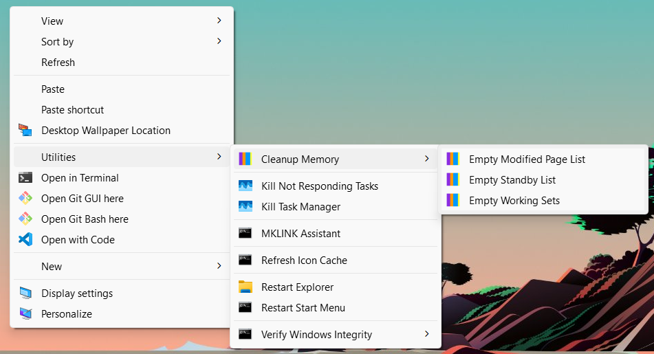

## Utilities Menu for Windows 11 Desktop Context Menu
A simple set of utilities added to the Windows 11 desktop context menu for quick access to common tasks.

### Features

- **Cleanup Memory**: Free up memory with by clearing the Working Sets, Standby List, and Modified Page List with the RAMMap Memory Cleanup Script. *(Requires RAMMap to be installed and added to PATH)*
- **Kill Not Responding Tasks**: Finds and kills all non-responding tasks
- **Kill Task Manager**: Forcibly closes the Task Manager process to resolve issues
- **MKLINK Assistant**: Assists in creating symbolic/hard links, and directory junctions using the MKLINK command
- **Refresh Icon Cache**: Refreshes the icon and thumbnail cache to fix icon display issues
- **Restart Explorer**: Restarts Windows Explorer to resolve various UI issues
- **Restart Start Menu**: Restarts the Start Menu to resolve various UI issues
- **Verify Windows Integrity**: Verify and repair system files using the System File Checker (SFC) tool and Deployment Imaging Service and Management Tool (DISM)

## Instructions

1. Download the ZIP file from the link below.
2. Extract the contents of the ZIP file to a folder of your choice.
3. Copy the `Utilities` folder to the root of your `C:` drive `(C:\Utilities)`.
4. Double-click the `Add Utilities Menu to Desktop Context Menu.reg` file to add the Utilities Menu to your desktop context menu.
5. To remove the Utilities Menu from your desktop context menu, double-click the `Remove Utilities Menu from Desktop Context Menu.reg` file.

**Download**: [Download ZIP](https://github.com/The-Back-Room/Utilities-Menu-for-Windows-11-Desktop-Context-Menu/archive/refs/heads/main.zip)
